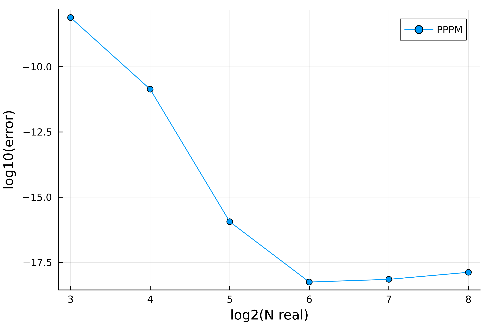

# ChebParticleMesh.jl

<!-- [](https://HPMolSim.github.io/ChebParticleMesh.jl/stable/) -->
<!-- [](https://HPMolSim.github.io/ChebParticleMesh.jl/dev/) -->
[](https://github.com/HPMolSim/ChebParticleMesh.jl/actions/workflows/CI.yml?query=branch%3Amain)
[](https://codecov.io/gh/HPMolSim/ChebParticleMesh.jl)


`ChebParticleMesh.jl` is a package based on `Julia`, which provide a set of tools for the widely used **Particle-Mesh** methods.
Using the tools provided by this package, you can easily create a uniform grid with arbitrary dims and periodicity, and then interpolate the particles onto the grid with provided/self-defined window functions so that the problem can be transformed into reciprocal space via **Fast Fourier Transform** and then being solved there.

## Getting Started

Add this package in julia by typing `]` in Julia REPL and then type
```julia
pkg> add ChebParticleMesh
```
to install the package.

## Introduction

In this package, the process of Particle-Mesh is divided into SIX different steps, including

1. Pre-computating: Generating the grid, the window function and scaling factors
2. Interpolation: Interpolating the point sources onto the grids
3. FFT: Using FFT to transform the density on grids into the reciprocal space
4. Scaling: Scale the fourier modes with the Green's function
5. IFFT: Using IFFT to transform the grid back to the real space
6. Gathering: Integrate the potential on the grid back to the particles

Specially, this package is called **Cheb**ParticleMesh.jl because we provided tools to approximate the window functions via piecewise Chebyshev poly, so that the calculation can be much faster when using some complicated kernels, such as the KB-kernel.
In this package, only pre-computation leads to huge allocation but only needed to be calculated once before the calculation. 
FFT and IFFT needs 4 allocations by FFTW; interpolating, scaling and gathering are allocation free, so that the package is highly efficient.

## Examples of Use

### Implentation of PPPM

In the following example, we will show how to use the `ChebParticleMesh.jl` to implentate the long-range part of the well known [P3M method](https://en.wikipedia.org/wiki/P3M).

The target is to compute the double summation:
$\sum_{\mathbf{m} \in \mathbb{Z}^3} \sum_{i, j} q_i q_j \frac{\mathrm{erf}( \alpha (r_{ij} + L_m))}{r_{ij} + L_m}$.
where $\mathrm{erf}(\cdot)$ for the error function and $\mathbf{L_m} = (m_x L_x, m_y L_y, m_z L_z)$ for the periodic images.

First we set up the system:
```Julia
L = 10.0, 10.0, 10.0 # size of the box
periodicity = (true, true, true) # fully periodic
extra_pad = (0, 0, 0) # no extra padding needed
N_real = (16, 16, 16) # 16 grids in each direction in real space
w = N_real ./ 4 # cutoff of interpolating
α = 0.5
```

Precomputation:
```julia
# Grid generation
gridinfo = GridInfo(N_real, w, periodicity, extra_pad, L)
gridbox = GridBox(gridinfo)

# using the Wkb window function, and generate its Chebyshev approximation
f_window = [x -> Wkb(x, (w[i] + 0.5) * gridinfo.h[i], 5.0 * w[i]) for i in 1:3]
cheb_coefs = tuple([ChebCoef(f_window[i], gridinfo.h[i], w[i], 10) for i in 1:3]...)

# using the Fourier transform of the window function and Green's function in Fourier space to generate the scaling factors
F_f_window = [x -> FWkb(x, (w[i] + 0.5) * gridinfo.h[i], 5.0 * w[i]) for i in 1:3]
func_scale = (kx, ky, kz) -> iszero(kx^2 + ky^2 + kz^2) ? zero(T) : (F_f_window[1](kx) * F_f_window[2](ky) * F_f_window[3](kz))^(-2) * exp(-(kx^2 + ky^2 + kz^2) / (4*α^2)) / (kx^2 + ky^2 + kz^2)
scalefactor = ScalingFactor(func_scale, gridinfo)
```

Generate some randomly allocated particles as input
```julia
n_atoms = 200
qs = 2.0 .* rand(n_atoms) .- 1.0
qs .-= sum(qs) / n_atoms
poses = [L .* (rand(), rand(), rand()) for i in 1:n_atoms]
```

Compute:
```julia
interpolate!(qs, poses, gridinfo, gridbox, cheb_coefs)
fft!(gridbox)
scale!(gridbox, scalefactor)
ifft!(gridbox)
E = gather(qs, poses, gridinfo, gridbox, cheb_coefs) / 8π
```

The full script is given in `example/PPPM.jl`, the result is compared with a mesh-free method, `Ewald3D` provided by `EwaldSummations.jl` and shows great convergency as the number of grid points increase.


## How to Contribute

If you find any bug or have any suggestion, please open an issue.
